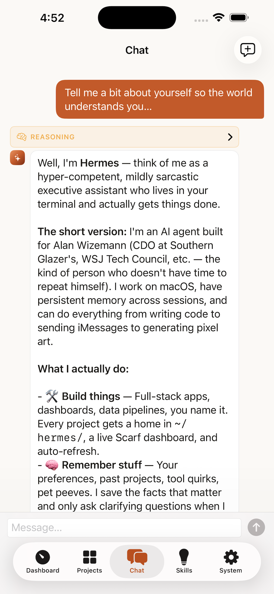

<p align="center">
  
</p>

<h1 align="center">Scarf</h1>

<p align="center">
  <strong>The native Mac &amp; iOS app for your <a href="https://github.com/hermes-ai/hermes-agent">Hermes AI agent</a>.</strong><br>
  See every session, project, skill, memory file, and cron job — on your Mac, and from your iPhone over SSH.
</p>

<p align="center">
  <a href="https://awizemann.github.io/scarf/">Website</a> ·
  <a href="https://github.com/awizemann/scarf/releases/latest">Download for Mac</a> ·
  <a href="https://testflight.apple.com/join/qCrRpcTz">iPhone TestFlight</a> ·
  <a href="https://github.com/awizemann/scarf/wiki">Wiki</a> ·
  <a href="https://awizemann.github.io/scarf/#faq">FAQ</a>
</p>

<p align="center">
  
  
  
  
  
</p>

<p align="center">
  <a href="https://trendshift.io/repositories/26763?utm_source=repository-badge&amp;utm_medium=badge&amp;utm_campaign=badge-repository-26763" target="_blank" rel="noopener noreferrer"></a>
  <a href="https://trendshift.io/repositories/26763?utm_source=trendshift-badge&amp;utm_medium=badge&amp;utm_campaign=badge-trendshift-26763" target="_blank" rel="noopener noreferrer"></a>
  <a href="https://trendshift.io/repositories/26763?utm_source=trendshift-badge&amp;utm_medium=badge&amp;utm_campaign=badge-trendshift-26763" target="_blank" rel="noopener noreferrer"></a>
</p>

<p align="center">
  
</p>

## Why Scarf

Hermes is a terminal-and-messaging agent — powerful, but invisible. Scarf gives it a face:

- **Full visibility.** Every session, message, tool call, token, and dollar — live dashboards, full-text search, activity feeds, cost breakdowns.
- **Full control.** Chat with rich streaming (ACP) or a real terminal, edit memory and skills, manage cron, gateways, MCP servers, and every config key — from a GUI instead of YAML.
- **Your servers, no middleman.** Local `~/.hermes/` or any number of remote hosts over plain SSH (your existing `~/.ssh/config`, agent, ProxyJump). There is no companion service in the middle — nothing between your device and your Hermes host.
- **Native and safe.** Pure Swift 6 / SwiftUI — no Electron. Hermes state is opened read-only; management actions go through the `hermes` CLI, so Scarf can't corrupt your agent's data.
- **Version-adaptive.** Scarf detects each host's Hermes version and capability-gates its UI: Hermes v0.6 through v0.20 all work, and newer-only surfaces simply hide on older hosts.

Available in English, 简体中文, Deutsch, Français, Español, 日本語, and Português (Brasil).

## ScarfGo — your agent in your pocket

<p align="center">
  <a href="assets/screenshots/scarfgo-servers.png"></a>
  <a href="assets/screenshots/scarfgo-chat.png"></a>
  <a href="assets/screenshots/scarfgo-project-dashboard.png"></a>
  <a href="assets/screenshots/scarfgo-skills.png"></a>
  <a href="assets/screenshots/scarfgo-system.png"></a>
</p>

**ScarfGo** is the native iPhone companion — the same Hermes servers you run from your Mac, reachable from your phone. Multi-server, project-scoped chat with session resume, project dashboards, skills browsing + Hub install, memory editor, cron, and per-server Hermes profile switching. Pure-Swift SSH (Citadel) — the Ed25519 private key is generated on-device, lives in the iOS Keychain, and never leaves the phone.

**[Join the public TestFlight →](https://testflight.apple.com/join/qCrRpcTz)**

Connecting takes about a minute: add a server (same details as `ssh user@host`), tap **Generate Key**, paste the public key into the host's `~/.ssh/authorized_keys`, tap **Test connection**. Full walkthrough: [ScarfGo Onboarding](https://github.com/awizemann/scarf/wiki/ScarfGo-Onboarding) · feature tour: [ScarfGo](https://github.com/awizemann/scarf/wiki/ScarfGo) · Mac-vs-iOS matrix: [Platform Differences](https://github.com/awizemann/scarf/wiki/Platform-Differences).

## Privacy

Scarf for macOS collects **anonymous usage statistics** (event names + fixed-vocabulary properties, never content, paths, or hostnames; no persistent identifier) to guide development. Opt out any time in **Settings → Advanced → Usage Analytics**. ScarfGo for iOS collects nothing. Details in the [Privacy Policy](https://awizemann.github.io/scarf/privacy/).

## What's New in 2.24.0

- **Bots** ⚙ — a new top-level section above Chat for Hermes's Bot Mode: your roster of named agents with native deterministic avatars, full create/edit/delete, and one-click promotion of any profile to a bot. Interops both ways with Hermes's own desktop — same profiles, same chats.
- **Live bot conversations** ⚙ — each bot's canonical Bot Chat as a real streaming Scarf chat (tokens, thinking, tool cards, inline permissions) over ACP, locally or across plain SSH.
- **Routines & remote bots** ⚙ — per-bot scheduled jobs that run as the right bot (delegation-wrapped exactly like Hermes desktop's), and your `hermes peer` bots in the roster for DMs and async runs.
- **Five-audit release pass** — independent audits of Bot Mode, the last two releases, Chat, Bots, and Settings; every blocking finding fixed: bot chats get the full slash menu, failures render as failures, a silent no-op Settings toggle works, three dead Settings rows removed, accessibility gaps closed, and the shared UI components are now localization-ready.

Full notes: [v2.24.0](https://github.com/awizemann/scarf/releases/tag/v2.24.0) · v2.23.0 brought Hermes v0.21 "Pantheon" parity (Peers, cron health, tripled MCP catalog) · **all previous releases:** [Release Notes Index](https://github.com/awizemann/scarf/wiki/Release-Notes-Index).

## Features

Scarf mirrors Hermes's whole surface through a sidebar UI. Sections marked ⚙ are capability-gated — they appear only when the connected host's Hermes version supports them.

### Projects — mission control per repo

Projects sit first in the sidebar because that's how you actually work. Selecting one opens a unified **cockpit**: Dashboard, Sessions, Board, Site, Context, Cron, Memory, Secrets, Templates, Slash commands, Mini-apps, and Fleet.

- **Project dashboards** — agent-generated JSON dashboards with stat boxes, charts, tables, progress bars, checklists, and embedded web views, live-refreshed. See [Project Dashboards](#project-dashboards) below.
- **Kanban board** ⚙ — full read/write board over Hermes's Kanban, per-project tenants, chat-scoped views.
- **Mini-apps** — sandboxed HTML/CSS/JS panels inside a project that can drive your agent through a rate-limited, permission-gated bridge (locked-down `WKWebView`, default-deny permissions reviewed on first open).
- **Fleet & Portfolio** — the same repo on several machines groups into one logical project; Scarf flags config drift and can push model presets, boards, and cron to the whole fleet.
- **Templates** — install `.scarftemplate` bundles from the [community catalog](https://awizemann.github.io/scarf/templates/), a local file, or a `scarf://install` link; export your own.
- **Project chats load your context** — chats spawn Hermes with the project as cwd, so `AGENTS.md` / `CLAUDE.md` / `.cursorrules` load automatically, on Mac and iOS alike.

### Monitor

- **Dashboard** — system health, token usage, cost tracking (per-model breakdown on Hermes 0.20), recent sessions.
- **Insights** — usage analytics: token/cost trends, model + platform stats, top tools, activity heatmaps, 7/30/90-day filtering.
- **Sessions** — full conversation history with reasoning display, tool-call inspection, full-text search, pin/rename/delete, and Markdown/HTML/Quarto/JSONL export with secret redaction.
- **Activity** — live tool-execution feed with filtering and a detail inspector.

### Interact

- **Chat** — two modes: **Rich Chat** streams over the Agent Client Protocol (ACP) with markdown, tool-call visualization, thinking display, permission prompts, and per-session edit-approval modes; **Terminal** runs `hermes chat` in a real terminal ([SwiftTerm](https://github.com/migueldeicaza/SwiftTerm)). Both persist sessions, resume, and auto-reconnect.
- **Memory** — view/edit MEMORY.md and USER.md with live refresh and profile-scoped memory.
- **Curator** ⚙ — Hermes's skill curator: status, archive idle skills, consolidation controls.
- **Skills** — browse installed skills, search the Skills Hub across registries, install/update/uninstall from the app.

### Configure

- **Platforms** — native setup forms for Hermes's messaging platforms (Telegram, Discord, Slack, WhatsApp, Signal, iMessage, Matrix, ntfy, and more) including QR pairing flows.
- **Personalities · Quick Commands · Credential Pools · Plugins · Webhooks · Profiles** — every Hermes identity/extension surface, with safe write paths.
- **Models** ⚙ — the model picker as a first-class pane, with local-model discovery (Ollama, LM Studio, vLLM, llama.cpp — local or over SSH), context-window guards, and vision-capability warnings.
- **Hermes Proxy** ⚙ — launch Hermes's OpenAI-compatible local proxy and point Codex CLI / Aider / Cline / Continue at it.

### Manage

- **Tools · MCP Servers · Messaging Gateway · Cron · Health · Logs · Settings** — toolset toggles per platform; full MCP server management (presets, OAuth, mTLS, test-connection); gateway start/stop + pairing; full cron CRUD with run history; health diagnostics with one-click fixes; live log tailing with session-ID filtering; and a structured Settings editor covering essentially every `config.yaml` key Hermes exposes — written through a lossless YAML editor that preserves everything it doesn't model.

## Multi-server: one window per server

Scarf is a multi-window app — each window binds to one Hermes server. Your local `~/.hermes/` appears automatically; add remotes via **File → Open Server… → Add Server**. Remote hosts are reached over system SSH (your `~/.ssh/config`, ssh-agent, ProxyJump, ControlMaster); SQLite is served from atomic snapshots; chat tunnels as `ssh -T host -- hermes acp`. Everything works against remote identically to local.

**Remote host requirements:** key-based SSH (run `ssh-add` once), `sqlite3` and `pgrep` on the remote `PATH`, and `~/.hermes/` readable by the SSH user. If the Dashboard shows "Stopped" or empty values on a green connection, open **Manage Servers → 🩺 Run Diagnostics** — fourteen checks in one SSH session, each with a remediation hint. Details: [Servers & Remote](https://github.com/awizemann/scarf/wiki/Servers-and-Remote).

## Requirements & compatibility

- **macOS 14.6+** (Scarf) · **iOS 18+** (ScarfGo) · Xcode 16+ to build from source.
- **[Hermes](https://github.com/hermes-ai/hermes-agent) v0.6.0+** on each host. Current target: **v0.20.4 "Herald"** (v2026.8.18) — every newer surface is capability-gated or schema-detected, so older hosts keep working with newer-only UI hidden.

| Hermes | Status |
|--------|--------|
| v0.6.0 – v0.17.0 (2026-03 → 2026-06) | Verified — full feature history in the [wiki compatibility page](https://github.com/awizemann/scarf/wiki/Hermes-Version-Compatibility) |
| v0.18.x (2026-07) | Verified — `messages.compacted` schema detection, MoA + Vertex providers |
| v0.19.x "Quicksilver" | Verified — audited as part of the v0.18.2 → v0.20.0 source delta |
| v0.20.0 "Herald" (2026-08-03) | Verified — pinned sessions, per-model cost, new exports, `/compress`, cron run history, profile routing |
| v0.20.4 "Herald" (2026-08-18) | **Verified — current target** — curator ledger/purge, project skills, unread sessions, MCP catalog + identity headers, personalities-in-code |

Scarf reads Hermes's SQLite database and CLI output with automatic schema detection. If a Hermes update changes either, the Health view shows compatibility warnings.

## Install

### Pre-built binary (recommended)

Download from [Releases](https://github.com/awizemann/scarf/releases): `Scarf-vX.X.X-Universal.zip` (Apple Silicon + Intel) or `-ARM64.zip` (smaller). Unzip, drag **Scarf.app** to Applications, launch — builds are Developer ID signed and notarized. Updates arrive automatically via [Sparkle](https://sparkle-project.org).

<details>
<summary><strong>"Scarf.app is damaged" on first launch?</strong></summary>

The bundle is fine — every release passes `codesign --verify --strict --deep` and `spctl --assess` before shipping. Remove only the quarantine attribute:

```bash
xattr -d com.apple.quarantine /Applications/Scarf.app
```

Or extract with `ditto -xk` instead of double-clicking the zip. **Do not** run `xattr -rc` (strips codesign xattrs) or `codesign --force --deep --sign -` (corrupts Sparkle's nested signatures). If a clean re-download + quarantine removal doesn't fix it, open an issue with `codesign --verify --verbose=4 --strict` output captured before any mitigation.
</details>

### Build from source

```bash
git clone https://github.com/awizemann/scarf.git
cd scarf/scarf
open scarf.xcodeproj
```

No Apple Developer account? Use [`./scripts/local-build.sh`](scripts/local-build.sh) for an unsigned Debug build — see [BUILDING.md](BUILDING.md).

## Project Dashboards

Drop a `.scarf/dashboard.json` into any project and Scarf renders a live-updating dashboard — stat boxes, charts, tables, progress bars, checklists, rich text, and embedded web views. The real power is letting your Hermes agent generate and maintain it (from cron, after builds, whenever state changes — Scarf watches the file):

```json
{
  "version": 1,
  "title": "My Project",
  "sections": [{
    "title": "Overview",
    "columns": 3,
    "widgets": [
      { "type": "stat", "title": "Test Coverage", "value": "87%", "icon": "checkmark.shield", "color": "green" },
      { "type": "progress", "title": "Sprint", "value": 0.73, "label": "73% complete" },
      { "type": "list", "title": "Tasks", "items": [{ "text": "Deploy to prod", "status": "pending" }] }
    ]
  }]
}
```

Register the project by appending `{ "name": "...", "path": "..." }` to `~/.hermes/scarf/projects.json` (or click **Projects → +**). Widget types: `stat` (with optional `sparkline`), `progress`, `text`, `table`, `chart`, `list`, `webview` (embeds a full browser tab for local dev servers, reports, Grafana, …), `markdown_file`, `log_tail`, `cron_status`, `status_grid`, `kanban_summary`, and `image`. Full schema + examples: [DASHBOARD_SCHEMA.md](scarf/docs/DASHBOARD_SCHEMA.md).

## Architecture

MVVM-Feature, Swift 6 strict concurrency, and only two external dependencies ([SwiftTerm](https://github.com/migueldeicaza/SwiftTerm) and [Sparkle](https://github.com/sparkle-project/Sparkle)) — everything else is system frameworks. Mac app, iOS app, and the shared `ScarfCore`/`ScarfDesign`/`ScarfIOS` packages live in one Xcode project. Hermes state (`state.db`, `config.yaml`, logs, memory, skills) is read directly — `state.db` strictly read-only to avoid WAL contention — and management actions go through the `hermes` CLI. The app sandbox is disabled because Scarf must read `~/.hermes/` and spawn the Hermes binary (which is also why it can't ship on the App Store).

Deep dives: [Architecture Overview](https://github.com/awizemann/scarf/wiki/Architecture-Overview) · [Transport Layer](https://github.com/awizemann/scarf/wiki/Transport-Layer) · [Data Model](https://github.com/awizemann/scarf/wiki/Data-Model) · [ACP Subprocess](https://github.com/awizemann/scarf/wiki/ACP-Subprocess).

## Releases

Scarf ships through GitHub Releases via one local script ([scripts/release.sh](scripts/release.sh)): universal archive → Developer ID signing → notarization → stapling → Sparkle EdDSA-signed appcast on `gh-pages` → GitHub release + tag. The appcast is served from [awizemann.github.io/scarf/appcast.xml](https://awizemann.github.io/scarf/appcast.xml).

## Contributing

Contributions are welcome — several of Scarf's best recent fixes were community PRs. Open an issue to discuss before submitting a PR; see [CONTRIBUTING.md](CONTRIBUTING.md) for the architecture rules, the zero-warnings bar, and the 8-step recipe for **contributing a new language**. Template submissions have their own flow with CI validation: [templates/CONTRIBUTING.md](templates/CONTRIBUTING.md).

## Support

Questions → the [website FAQ](https://awizemann.github.io/scarf/#faq) or the [Wiki](https://github.com/awizemann/scarf/wiki) · bugs → [GitHub issues](https://github.com/awizemann/scarf/issues).

If Scarf is useful to you:

<a href="https://www.buymeacoffee.com/awizemann"></a>

## License

[MIT](LICENSE)
